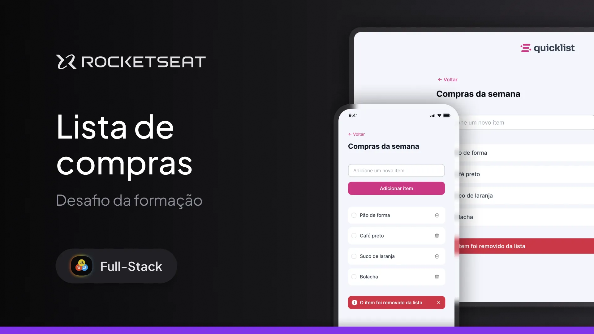

<h1 align="center">Quick-list</h1>

Aplicação de lista de compras Quick-list. Projeto desenvolvido durante aulas do curso Fullstack da Rocketseat, com foco nos conceitos de:

- Javascript;
- Funções;
- Manipulação da DOM;
- Eventos.

  <a href="#-tecnologias">Tecnologias</a>&nbsp;&nbsp;&nbsp;|&nbsp;&nbsp;&nbsp;
  <a href="#-projeto">Projeto</a>&nbsp;&nbsp;&nbsp;|&nbsp;&nbsp;&nbsp;

  

 

  

## 🚀 Tecnologias

Este projeto foi desenvolvido com as seguintes tecnologias:

- HTML e CSS
- Javascript
- Git e GitHub  
- Figma

## 💻 Projeto

Aplicação de lista de compras.

- [Acesse o projeto finalizado online](https://dev-filipebcs.github.io/quicklist/)
